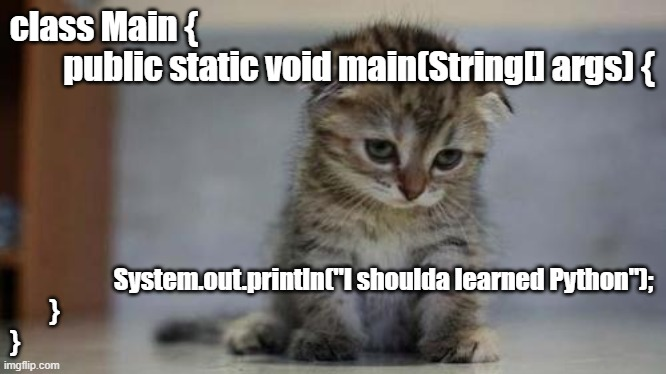

# Coding-Rubbish

  

## Java CheatSheet

### ***String, char, Integer conversion***
[String to int]:     Integer.parseInt(s);        // return int primitive   
[String to Integer]: Integer.valueOf(s); 	     // return an Integer Object  
[int to String]:     String.valueOf(int)  
[char[] to String]:  String str = new String(chArray);  
[list to array]:     String[] arr = list.toArray(new String[list.size()]);  
[array to list]:     List<String> list = Arrays.asList(arr);   可以直接罗列array的元素，比如：Arrays.asList("first", "second");  
                                                              非常适合于 convert single element to list  
 注意 Arrays.asList 返回的list形式的数组，可以修改某个element，但不能 add 或 remove elements  

### ***String***
String s = “a*b*c”;  
s.charAt(i); 
s.length(); 
s.substring(0, 1);            // [0, 1) 
s.substring(1);               //[1, s.length) 
s.equals(“b”); 
s.compareTo(“b*c*d”);         // return -1 because s comes first in lexicographical order 
s.trim(); 	                  // remove tailing and padding spaces 
s.indexOf(“a”);               // return first index of substring “a”   indexOf(substring) 
s.indexOf(‘a’, 2);            // indexOf(int ch, fromIndex), indexOf(String str, fromIndex) 
s.lastIndexOf(‘a’);           // also we can use s.lastIndexOf(String str) 
s.replaceAll(substr, target); // replace all substr to target in s 

char[] arr = s.toCharArray(); 
String[] arr = s.split("\\*") // when delimiter is '*' 
String[] arr = s.split("\\.") // when delimiter is '.' 
String res = String.join(String delimiter, List<String> data); // use the delimiter to concatenate the string in data.  
Objects.equals(Object a, Object b); // (1)if both parameters are null return true 
                                    // (2)if exactly one parameter is null return false 
                                    // (3)return the result of invoking the equals() method of the first parameter passing it the second parameter 
                                    // This behaviour means it is "null safe". 
                                    
### ***StringBuilder***
StringBuilder sb = new StringBuilder(); 
sb.append(“a”); 
sb.insert(0, “a”);            // sb.insert(int offset, char c) or sb.insert(offset, str) 
sb.deleteCharAt(int index); 
sb.reverse(); 
sb.toString(); 
sb.length();                  // return the number of characters in sb, similar to str.length() 

### ***Array***
int[] arr = new int[10]; 
Arrays.sort(arr); 
Arrays.fill(arr, -1);           // initialize all array elements with value -1 
public void helper(int[] nums); 
helper(new int[]{1, 2});        // initialize array in method 

### ***HashMap (TreeMap), HashSet (TreeSet)***
HashMap<Character, Integer> map = new HashMap<Character, Integer>(); 
map.put('c', 1); 
map.get('c'); 
map.getOrDefault(key, defaultValue);                         // if key exists return value, else return default value 
map.remove(‘c’);                                             // remove key and its value 
map.computeIfAbsent(key, mappingFunction);                   // if key exists return value, else create a value by mappingFunction 
map.computeIfAbsent(key, k -> new HashSet<>()).add(val); 
map.computeIfAbsent(key, k -> new ArrayList<>()).add(val);   // RECOMMENDED !!! 
if (map.containsKey('c')) {                                  // check if key exists 
} 
if (map.containsValue(1)) {                                  // check if value exists 
} 
for (Character d : map.keySet()) {                           // traverse key set 
} 
for (Integer i : map.values()) {                             // traverse value set 
} 
for(Map.Entry<Character, Integer> entry : map.entrySet()){   // traverse key-value pair 
    entry.getKey(); 
    entry.getValue(); 
} 
map.forEach((k,v) -> System.out.println("key: "+k+" value:"+v)); // traverse key-value pair using lamda expression to print out info 
 
map.isEmpty(); 
map.size(); 
HashSet<Integer> set = new HashSet<Integer>(); 
set.add(10); 
set.remove(10); 
if(set.contains(10)){ 
} 
set.size(); 
set.isEmpty(); 
setA.retainAll(setB); // setA keeps the intersection of original setA and setB; 
setB.removeAll(setC); // Removes from this set all of its elements that are contained in the specified collection (setB - setC) 
setC.addAll(setD);    // union two sets of setC and setD 
setC.containsAll(setD); // Returns true if this set contains all of the elements of specified collection 
Object[] arr = setA.toArray(); // Returns an array containing all of the elements in this set. 

TreeMap<Integer, String> map = new TreeMap<>();             // key’s ascending order (default) 
map.put(2, “b”); 
map.put(1, “a”); 
map.put(3, “c”); 
for(String str : map.values())                              // traverse in “a” “b” “c” order 
for(Integer num : map.keySet())			                    // traverse in  1, 2, 3 order 

TreeMap<String, Integer> treeMap = new TreeMap<>();             // sorted in lexicographical order 
TreeMap<Integer, Integer> treeMap = new TreeMap<>(Collections.reverseOrder()); // descending order 

treeMap.lowerKey(k);                                        // return the greatest key strictly less than the given key,  
treeMap.floorKey(k);                                        // return the greatest key less than or equal to key 
treeMap.higherKey(k);                                       // return the greatest key strictly larger than the given key,  
treeMap.ceilingKey(k);                                      // return the greatest key larger than or equal to key 
treeMap.firstKey();                                         // returns the first (lowest) key currently in this map. 
SortedMap<K,V> portionOfTreeMap = treeMap.headMap(K toKey); // Returns a view of the portion of this map whose keys are strictly less than toKey. 
NavigableMap<K,V> map = treeMap.headMap(toKey, true);       // Returns a view of the portion of this map whose keys are less than or equal to toKey. 

Set<Integer> treeSet = new TreeSet<>();                     // sort in ascending order by default 
treeSet.lower(Integer e);	                                // return greatest element that is < e, or null if no such element 
treeSet.floor(Integer e);	                                // return greatest element that is <= e, or null if no such element 
treeSet.ceiling(Integer e);                                 // return smallest element that is >= e, or null if no such element 
treeSet.higher(Integer e);                                  // return smallest element that is > e, or null if no such element 
treeSet.first();                                            // return the first element in the treeset (if min set, return minimum element) 
treeSet.last();                                             // return the last element in the treeset 

### ***LinkedHashMap, LinkedHashSet***
Map<Integer,String> map = new LinkedHashMap<>(); 
map.put(1, "first"); 
map.put(2, "second"); 
map.put(3, "third");            
for(Map.Entry<Integer,String> entry : map.entrySet()) 
    System.out.println(entry.getKey (), entry.getValue());   // print order: 1, 2, 3 
Set<Integer> set = new LinkedHashSet<>(); 

### ***List, ArrayList, LinkedList***
List<Integer> list = new ArrayList<>(); 
list.add(14); 
list.add(0, 10);                			            // list.add(int index, int value); 
list.get(int index);
list.remove(list.size() - 1); 
list.set(int index, int val);                     // replaces element at index and returns original 
list.indexOf(Object o);                           // return first index of occurrence of specified element in the list; -1 if not found 
list.subList(int fromIndex, int toIndex);         // return a sublist within range [fromIndex, toIndex) 
Collections.sort(list);				                    // ascending order by default 
Collections.sort(list, Collections.reverseOrder());         // descending order 
Collections.sort(list, new Comparator<Integer>() { 
   @Override 
   public int compare(Integer o1, Integer o2) {             // the Integer can be any Object instead 
   return o1 ‐ o2;// 0‐>1 
   // return o2‐o1; 1‐>0 
   } 
}); 
list.forEach(num -> system.out.println(num));   // traverse the list and print out by using lamda function 
list.stream().mapToInt(i -> i).toArray(); -> arraylist to array 
  
  
### ***Stack, Queue, PriorityQueue, Deque***
Stack<Integer> stack = new Stack<Integer>(); 
stack.push(10); 
stack.pop(); 
stack.peek(); 
stack.isEmpty(); 
stack.size(); 
Queue<Integer> q = new LinkedList<Integer>(); 
q.offer(10);    					                                          // q.add() is also acceptable 
q.poll(); 
q.peek(); 
q.isEmpty(); 
q.size(); 
PriorityQueue<Integer> pq = new PriorityQueue<>();                            // minimum Heap by default 
PriorityQueue<Integer> pq = new PriorityQueue<>(Collections.reverseOrder());  // change to maximum Heap 
pq.add(10); 
pq.poll(); 
pq.peek(); 
pq.isEmpty(); 
pq.size(); 
class Node implements Comparable<Node>{ 
    int x; 
    int y; 
    public Node(int x, int y){ 
        this.x = x; 
        this.y = y; 
    } 
    @Override 
    public int compareTo(Node that){ 
        return this.x - that.x;                            // ascending order / minimum Heap 
        // return that.x - this.x;			               // descending order / maximum Heap 
    } 
} 
PriorityQueue<Node> pq = new PriorityQueue<>(); 

import java.util.Deque;  
Deque<Integer> dq = new LinkedList<Integer>();    // Deque is usually used to implement monotone queue 
dq.addFirst();  //  dq.offerFirst(); 
dq.addLast();   //  dq.offerLast(); 
dq.peekFirst(); //  
dq.peekLast(); 
dq.pollFirst(); //  dq.removeFirst(); 
dq.pollLast();  //  dq.removeLast(); 
 
### ***Enum***
set1 = EnumSet.of(Gfg.QUIZ, Gfg.CONTRIBUTE,  Gfg.LEARN, Gfg.CODE);  
set2 = EnumSet.complementOf(set1);              // initially containing all the elements of this type that are not contained in the specified set 
set3 = EnumSet.allOf(Gfg.class);                 
set4 = EnumSet.range(Gfg.CODE, Gfg.CONTRIBUTE); // contains all of the elements in the range defined by the two specified endpoints. 

### ***Random method***
Random rand =new Random();    // initialize Random object 
int i = rand.nextInt(100);    // generate random number in [0, 100) 
float f = rand.nextFloat();   // generate float value in [0, 1) 
double d = rand.nextDouble(); // generate double value in [0.0, 1.0) 

### ***Math***
Math.pow(double x, double y); // return x^y  
Math.round(float a);          // returns the closest int to the argument 
Math.abs(int/float/doubld val); 
Math.sqrt(); 
 Math.sin(double rad);         // input is rad not angle 
Math.PI; 
Math.E; 
 
### ***Collections/Object***
Collections.nCopies(100, new Object[]{true});// return an immutable list which contains n copies of given object 
getClass()                                   // Returns the runtime class of this {@code Object} 
Collections.singletonList()                  // use it to replace Arrays.asList() when there is only one element 
Collections.unmodifiableSet(new HashSet<>()) // returns an unmodifiable view of the specified set. Note that, changes in specified set will be reflected in unmodifieable set.  
                                             // Also, any modification on unmodifiableSet is not allowed, which triggers exception. 
Collections.swap(List, int i, int j);        // swap the ith and jth element in list  
### ***Lamda expression***
1. Functional interface: the interface contains exactly one abstract method 
   @FunctionalInterface  
   public interface Sprint { 
      public void sprint(Animal animal);  
   } 
2. lamda expression 
   a -> a.canHop()   等价于 (Animal a) -> { return a.canHop(); } 
    
### ***std input/output  file read/write***
import java.io.*; 
import java.net.*; 
Scanner in = new Scanner(System.in); 
int n = in.nextInt(); 
while(in.hasNext()){ 
    String str = in.nextLine(); 
} 
 
String inputfile="in.txt"; 
String outputfile="out.txt"; 
try 
{ 
    BufferedReader in = new BufferedReader(new FileReader(inputfile)); 
    line = in.readLine(); 
    while (line!=null) 
    { 
        // do something with line 
        line=in.readLine(); 
    } 
    in.close();              // close the file 
} catch (IOException e) 
{ 
    e.printStackTrace(); 
} 
 
try{ 
    BufferedWriter out = new BufferedWriter(new FileWriter(outputfile)); 
    for(String str : map.keySet()){ 
         out.write(str + " " + map.get(str)); 
         out.newLine(); 
    } 
    out.close();           // close the file 
}catch (IOException e) 
{ 
    e.printStackTrace(); 
} 
 
URL wordlist = new URL("http://foo.com/wordlist.txt"); 
BufferedReader in = new BufferedReader(new InputStreamReader(wordlist.OpenStream())); 
String inputLine = null; 
List<String> res = new ArrayList<>(); 
while((inputLine = in.readLine()) != null){ 
    res.add(inputLine); 
} 
 
### ***Atomic Class***
 
//an atomic operation is supposed to be completed wholly or not at all. Based on CAS theory 
AtomicInteger count = new AtomicInteger(0); 
count.getAndSet(); 
count.incrementAndGet(); 
count.getAndIncrement(); 
count.decrementAndGet(); 
count.getAndDecrement(); 
 
AtomicBoolean enabled = new AtomicBoolean(initialValue: false); 
boolean result = enabled.compareAndSet(expect:true, update:false);  // if result = false, means actual value doesn't equal to expect one 
 
AtomicReference<AmbryClientException> exceptionInCallback = new AtomicReference<>(null); // an atomic object allowing method to perform atomic operations 
exceptionInCallback.get(); 
exceptionInCallback.set(); 
exceptionInCallback.compareAndSet(expected, update); // Atomically sets the value to the given updated value if the current value == the expected value. 
 
AtomicStampedReference<Person> s  = new AtomicStampedReference<Person>(new Person(20), stampVal); 
s.compareAndSet(s.getReference(), new Person(s.getReference().age+10), stampVal, ++stampVal); // s.compareAndSet(expected_reference, update_reference, expected_stamp, update_stamp); 
 
### ***ExecutorService(create and manage threads)***
   
(1)Future: Think of a Future as an object that holds the result – it may not hold it right now,  
           but it will do so in the future (once the Callable returns). Thus, a Future is basically one way  
           the main thread can keep track of the progress and result from other threads. 
(2)Callable: is similar to Runnable, in that it encapsulates a task that is meant to run on another thread. 
(3)In the thread pool, instead of using execute(Runnable r), you use submit(Callable r), which returns a Future<V> object (declared in the ExecutorService interface).  
   When the result is required, you can use get() method on the Future object. If the result is ready, it is returned,  
   otherwise, the calling thread is blocked until the result is available. 
  
ExecutorService service = new Executor.newSingleThreadExecutor();           // single thread executor 
ExecutorService service = new Executor.newSingleThreadScheduledExecutor();  // single thread can run after delay or periodically 
ExecutorService service = new Executor.newCachedThreadPool();               // if previous thread is available, reuse it. Otherwise, create new thread as needed 
ExecutorService service = new Executor.newFixedThreadPool(int nThreads);    // create a pool with fixed number of threads 
ExecutorService service = new Executor.newScheduledThreadPool(int nThreads);// a pool with fixed number of threads and threads execute after delay or periodically 
 
service.execute(Runnable Object);                 // or lamda expression;  Executes a Runnable task at some point in the future 
Future<?> future = service.submit(Runnable task); // Executes a Runnable task at some point in the future and returns a Future representing the task 
service.shutdown();                               // finish running tasks and then terminate 
service.shutdownNow();                            // stop all running tasks immediately 
 
Future<?> result = service.schedule(Callable<V> callable, long delay, TimeUnit unit); 
Future<?> result = service.schedule(Runnable command, long delay, TimeUnit unit); 
Future<?> result = service.scheduleAtFixedDelay(Runnable command, long initialDelay, long delay, TimeUnit unit); // periodic execution. A fixed delay after completion of last execution 
Future<?> result = service.submit(Callable<V> callableWorker); 
future.isDone(); 
future.isCancelled(); 
future.cancel();                                // Attempts to cancel execution of the task. 
future.get();                                   // Retrieves the result of a task, waiting endlessly if it is not yet available. 
future.get(long timeout, TimeUnit unit);        // Retrieves the result of a task, waiting the specified amount of time.  
 
### ***Synchronize Block/Method***
 
synchronized(object){}               // synchronized block (used at code snippet closest to the operation) 
private synchronized void update(){} // synchronized method 
List<Integer> list = Collections.synchronizedList( new ArrayList<>(Arrays.asList(4,3,52))); // used to wrap non-concurrent class 
 
### ***Concurrent Collection***
 
Map<String,Integer> map = new ConcurrentHashMap<>(); 
Queue<Integer> queue = new ConcurrentLinkedQueue<>(); 
Deque<Integer> deque = new ConcurrentLinkedDeque<>(); 
 
BlockingQueue<Integer> blockingQueue = new LinkedBlockingQueue<>(); 
blockingQueue.offer(E e, long timeout, TimeUnit unit);             //Adds item to the queue waiting the specified time, returning false if time elapses before space is available 
blockingQueue.poll(long timeout, TimeUnit unit);                   //Retrieves and removes an item from the queue, waiting the specified time, returning null if the time elapses before the item is available 
 
BlockingDeque<Integer> blockingDeque = new LinkedBlockingDeque<>(); 
blockingDeque.offerFirst(E e, long timeout, TimeUnit unit); 
blockingDeque.offerLast(E e, long timeout, TimeUnit unit); 
blockingDeque.pollFirst(long timeout, TimeUnit unit); 
blockingDeque.pollLast(long timeout, TimeUnit unit); 
 
 
 
/* ----- Introduction on CopyOnWriteArrayList ------- 
* When we’re calling the iterator() method on the CopyOnWriteArrayList,  
* we get back an Iterator backed up by the immutable snapshot of the content of the CopyOnWriteArrayList. 
* Its content is an exact copy of data that is inside an ArrayList from the time when the Iterator was created.  
* Even if in the meantime some other thread adds or removes an element from the list,  
* that modification is making a fresh copy of the data that will be used in any further data lookup from that list. 
* Because of the copying mechanism, the remove() operation on the returned Iterator is not permitted. 
*/
List<Integer> list = new CopyOnWriteArrayList<>(Arrays.asList(4,3,52));// use case: when we are iterating over it more often than we are modifying it.  
                                                                       // If adding elements is a common operation in our scenario, then CopyOnWriteArrayList won’t be a good choice  
                                                                       // – because the additional copies will definitely lead to sub-par performance. 
Set<Integer> set = new CopyOnWriteArraySet<>(); // copy all of their elements to a new underlying structure anytime an element is added, modified, or removed from the collection 
 
# The most notable pros of the ConcurrentSkipListMap are the methods that  
# can make an immutable snapshot of its data in a lock-free way.  

Map<String, Integer> map = new ConcurrentSkipListMap<>(); // concurrent version for sorted map like treemap, ascending order by default 
Set<String> set = new ConcurrentSkipListSet<>();          // concurrent version for sorted set like treeset, ascending order by default 
concurrentNavigableMap<K,V>.descendingMap();              // Returns a reverse order view of the mappings contained in this map 
 
### ***Generics - Get and Put rule***
Use an extends wildcard when you only get values out of a structure. 
Use a super wildcard when you only put values into a structure. 
And don't use a wildcard when you both want to get and put from/to a structure. 

Collection<? extends Fruit> // what we know is that the collection is one type of Fruit. We can get but cannot add into it in case that added fruit violates the current type 
Collection<? super Banana> // what we know is fruits in collection belong to parent class of banana. We can add fruit as long as we know the added fruit is parent class of banana. But we can't get one from it because we don't know what is excatly the type is. 

### ***CountDownLatch***
CountDownLatch是一个同步工具类，它允许一个或多个线程一直等待，直到其他线程的操作执行完后再执行. 
Background: 并发工具类还有CyclicBarrier、Semaphore、ConcurrentHashMap和BlockingQueue，它们都存在于java.util.concurrent包下。 
CountDownLatch是通过一个计数器来实现的，计数器的初始值为线程的数量。每当一个线程完成了自己的任务后，计数器的值就会减1。当计数器值到达0时，它表示所有的线程已经完成了任务，然后在闭锁上等待的线程就可以恢复执行任务。 
CountDownLatch use cases: 
    1.实现最大的并行性：有时我们想同时启动多个线程，实现最大程度的并行性。例如，我们想测试一个单例类。如果我们创建一个初始计数为1的CountDownLatch，并让所有线程都在这个锁上等待，那么我们可以很轻松地完成测试。 
                     我们只需调用 一次countDown()方法就可以让所有的等待线程同时恢复执行。 
    2.开始执行前等待n个线程完成各自任务：例如应用程序启动类要确保在处理用户请求前，所有N个外部系统已经启动和运行了。  
    3.死锁检测：一个非常方便的使用场景是，你可以使用n个线程访问共享资源，在每次测试阶段的线程数目是不同的，并尝试产生死锁。 
 
### ***review in OOP***
在Java中, static修饰的成员（method、field）表明它属于这个类本身，而不是这个类的某个实例； 
在Java中, 不要使用对象去调用static修饰的成员变量、方法，而是要用类去调用static修饰的成员。 
static块,用于初始化静态变量, 例如： 
   static int num; 
   static String mystr; 
   static{
      num = 97; 
      mystr = "Static keyword in Java";
   } 
   //Static Block is used for initializing the static variables. 
   //This block gets executed when the class is loaded in the memory.  
   //A class can have multiple Static blocks, which will execute in the same sequence in which they have been written into the program. 
 
 
final修饰Collection 比如 List, Map 意味着不能修改这个reference指向别的，但是我们仍允许修改这个Collection (add/delet element, etc) 
final修饰class, 意味着这个class不能被继承（extends） 
 
### ***Java NIO***
 
Background: Java NIO使我们可以进行非阻塞IO操作。比如说，单线程中从Channel读取数据到buffer，同时可以继续做别的事情 ，
            当数据读取到buffer中后，线程再继续处理数据。写数据也是一样的。 
NIO包含下面几个核心的组件： 
        Channels: 所有I/O都是从Channel开始的. 这些channel基于于UDP和TCP的网络I/O，以及文件I/O. 例如: FileChannel, ServerSocketChannel, DatagramChannel 等。 
        Buffers: Buffer涵盖了可以通过IO操作的基础类型。比如 ByteBuffer, IntBuffer etc.  
        Selectors: 选择器允许单线程操作多个通道。如果你的程序中有大量的链接，同时每个链接的I/O带宽不高的话，这个特性将会非常有帮助。比如聊天服务器。 
                  要使用Selector的话，我们必须把Channel注册到Selector上，然后就可以调用Selector的select()方法。 
                  这个方法会进入阻塞，直到有一个channel的状态符合条件。当方法返回后，线程可以处理这些事件 。
Channel的特点： 
    Channel可以读也可以写，stream一般来说是单向的（只能读或者写); 
    Channel可以异步读写; 
    Channel总是基于缓冲区Buffer来读写. 
Channel的实现: 
    FileChannel         用于文件的数据读写 
    DatagramChannel     用于UDP的数据读写 
    SocketChannel       用于TCP的数据读写 
    ServerSocketChannel 允许我们监听TCP链接请求，每个请求会创建会一个SocketChannel 
     
Buffer: 本质上就是一块内存区，可以用来写入数据，并在稍后读取出来。这块内存被NIO Buffer包裹起来，对外提供一系列的读写方便开发的接口。 
Buffer读写步骤： 
    (1)把数据装入buffer;   例如  int bytesRead = inChannel.read(buf);     //read into buffer. 
    (2)调用flip();        把Buffer从写模式切换到读模式; 
    (3)从Buffer中导出数据; 例如  int bytesWritten = inChannel.write(buf); //read from buffer into channel. 
    (4)调用buffer.clear()或者buffer.compact();    clear方法会重置position为0, compact则只清空已读取的数据，保留未读数据; 
Buffer有三个属性: 
    <1>capacity容量: 作为一块内存，buffer有一个固定的大小。一旦buffer写满了就需要清空已读数据以便下次继续写入新的数据。 
    <2>position位置: 读/写buffer时的位置。 
    <3>limit限制: 一旦切换到读模式，limit则代表我们所能读取的最大数据量，他的值等于写模式下position的位置。 
    <4>mark标记: A remembered position. Calling mark() sets mark = position. Calling reset( ) sets position = mark. The mark is undefined until set. 
    这4个的关系： 
               0 <= mark <= position <= limit <= capacity 
Buffer的常用API: 
    buffer.flip()      // 先set limit = current position, 再 reset position = 0; 
    buffer.clear()     // set the limit = capacity, reset position = 0; 
    buffer.rewind()    // 用于重新读一遍数据  reset position = 0, 保持limit不变 
    buffer.remaining() // The number of elements remaining in this buffer, 其实就是  limit - current position 
     
Scatter: 
    Scattering read指的是从通道读取的操作能把数据写入多个buffer，也就是sctters代表了数据从一个channel到多个buffer的过程。 
Gather: 
    gathering write则正好相反，表示的是从多个buffer把数据写入到一个channel中。 
Scatter/gather在有些场景下会非常有用，比如需要处理多份分开传输的数据。举例来说，假设一个消息包含了header和body，我们可能会把header和body保存在不同独立buffer中，这种分开处理header与body的做法会使开发更简明。 
 
在Java NIO中如果一个channel是FileChannel类型的，那么它可以直接把数据传输到另一个channel。这个特性得益于FileChannel包含的transferTo和transferFrom两个方法 
FileChannel.transferFrom(fromChannel, position, count)方法: 目标通道pull数据 
FileChannel.transferTo(position, count, toChannel)方法:   源通道push数据 
 
Selector: 用于检查一个或多个NIO Channel的状态是否处于可读、可写。如此可以实现单线程管理多个channels,也就是可以管理多个网络链接. 
   好处是: 我可以用更少的线程来处理channel。实际上，你甚至可以用一个线程来处理所有的channels。从操作系统的角度来看，切换线程开销是比较昂贵的，并且每个线程都需要占用系统资源，因此暂用线程越少越好。 
注册Channel到Selector上: 
    channel.configureBlocking(false);      //Channel必须是非阻塞的。所以FileChannel不适用Selector，因为FileChannel不能切换为非阻塞模式 
    SelectionKey key = channel.register(selector, SelectionKey.OP_READ); //第二个参数是一个“关注集合”, 代表我们关注的channel状态 
Channel状态: 
     (1)Connect:  SelectionKey.OP_CONNECT 
     (2)Accept:   SelectionKey.OP_ACCEPT 
     (3)Read:     SelectionKey.OP_READ 
     (4)Write:    SelectionKey.OP_WRITE 
 
SelectionKey对象包含以下属性: 
    The interest set; 
    The ready set; 
    The Channel; 
    The Selector; 
    An attached object (optional); 
     
  (1)interest set: is the set of events you are interested in "selecting". 
  (2)ready set:  is the set of operations the channel is ready for. 一般来说在调用了select方法后都会需要用到ready set 
  (3)channel: 
  (4)selector: Accessing the channel + selector from the SelectionKey is trivial. Like this: Selector selector = selectionKey.selector(); 
  (5)attached object: You can attach an object to a SelectionKey this is a handy way of recognizing a given channel,  
                      or attaching further information to the channel. 
                       
Selector 选择 channel的几个函数 
  select():              blocks until at least one channel is ready for the events you registered for. 
  select(long timeout):  does the same as select() except it blocks for a maximum of timeout milliseconds (the parameter). 
  selectNow():           doesn't block at all. It returns immediately with whatever channels are ready. 
注意：上述函数返回值是int, The int returned by the select() methods tells how many channels are ready. 
 
访问Ready的Channel 
You can access the ready channels via the "selected key set", by calling the selectors selectedKeys() method. 
Set<SelectionKey> selectedKeys = selector.selectedKeys();  
 
Close()函数 
When you are finished with the Selector you call its close() method.  
This closes the Selector and invalidates all SelectionKey instances registered with this Selector.  
The channels themselves are not closed. 
 
Java NIO SocketChannel: a channel that is connected to a TCP network socket. 
You can set a SocketChannel into non-blocking mode. When you do so, you can call connect(), read() and write() in asynchronous mode. 
connect() 
write() 
read() 
 

### ***Java I/O***
 
1. int read(byte[], int offset, int length) 
   The read(byte[], int offset, int length) method reads bytes into a byte array, but starts at offset bytes into the array,  
and reads a maximum of length bytes into the array from that position. Again, the read(byte[], int offset, int length) method  
returns an int telling how many bytes were actually read into array, remember to check this value before processing the read bytes.
